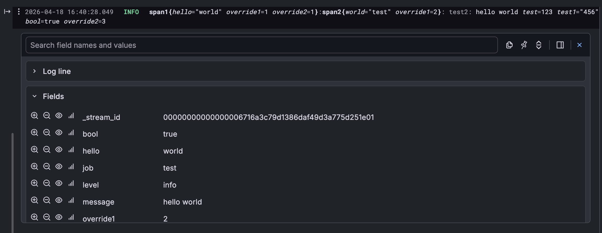

### Tracing layer that sends both human-readable log line (formatted with `tracing-subscriber`) and all it's fields into a log aggregation system in a structured way

#### Supported collectors are:

- [Victorialogs](https://docs.victoriametrics.com/victorialogs/), uses JSON with `_msg` set to a formatted log line
- [Grafana Loki](https://grafana.com/oss/loki/), uses formatted log line, storing all the fields as [structured metadata](https://grafana.com/docs/loki/latest/get-started/labels/structured-metadata/)

## Purpose

When used with log aggregation system, JSON logs are easy to manipulate but hard to read for a human.  
So this library combines both approaches, ingesting all fields in a structured way while also adding full
human-readable log line



Example
---

```rust
use std::time::Duration;

use eyre::Result;
use tokio::{spawn, time::sleep};
use tracing::{debug, info, info_span};
use tracing_combi_collector::sender::{loki::LokiSender, victorialogs::VictorialogsSender};
use tracing_subscriber::{fmt, layer::SubscriberExt, registry, util::SubscriberInitExt, EnvFilter};

#[tokio::main]
async fn main() -> Result<()> {
    // Loki
    let sender = LokiSender::new("http://grafana.proxmox/loki/api/v1/push")?
        .add_label("this_is_label", "test456")
        .add_label("job", "test")
        .add_field("this_is_static_field", "Test6666");

    // or Victorialogs
    let sender = VictorialogsSender::new("http://grafana.proxmox/vl/insert/jsonline")?
        .stream_fields(["job", "hello"])
        .extra_field("job", "test");

    let (layer, task) =
        tracing_combi_collector::Layer::new(sender, fmt::layer().without_time().with_level(false));
    spawn(task);

    registry()
        .with(EnvFilter::new("test2=trace,tracing_combi_collector=trace"))
        .with(fmt::layer())
        .with(layer)
        .init();

    let _span1 = info_span!("span1", hello = "world", override1 = 1, override2 = 1).entered();
    let _span2 = info_span!("span2", world = "test", override1 = 2).entered();

    info!(test = 123, test1 = "456", bool = true, override2 = 3, "hello world");

    for i in 0..500 {
        debug!(i);
    }

    // wait for the logs to be sent 
    // they are sent at 5-second intervals or when the buffer is full, whichever comes first
    sleep(Duration::from_secs(10)).await;

    Ok(())
}
```
